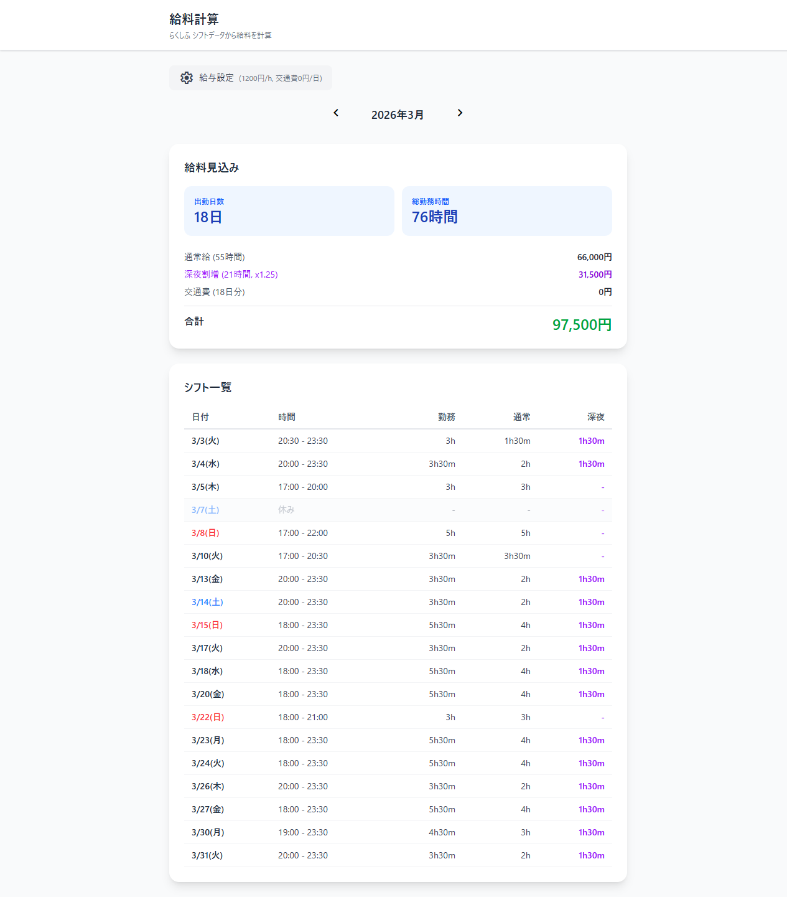

# rakushifu-detail

すかいらーくグループの「らくしふ」シフト管理サイトから確定シフトデータを取得し、予定通り働いた場合の給料を自動計算するWebアプリ。

## スクリーンショット

### ログイン画面


### ダッシュボード


## 機能

- らくしふへの自動ログイン・シフトデータ取得
- カレンダータブ（月グリッドでシフト日を確認し、日付を選んで時間・通常/深夜の内訳・メモ・その日に同じ時間へ入る人を表示）
- 月間シフト一覧表示（日付、時間、通常/深夜時間の内訳）
- シフト管理タブ（希望シフトの提出・閲覧・編集。期間送り、日ごとの出勤/休み/未入力、時刻、メモ、曜日指定の一括入力）
- 給与計算タブ（通常給、深夜割増 x1.25、交通費）
- 時給・交通費の設定（ブラウザに保存）
- 月切り替え表示

## 技術スタック

- React + TypeScript + Vite
- Tailwind CSS
- Vercel Serverless Functions（認証プロキシ・APIプロキシ）
- Vitest（テスト）

## セットアップ

```bash
git clone https://github.com/uta-a/rakushifu-detail.git
cd rakushifu-detail
npm install
npm run dev
```

`npm run dev` はフロントのみ。らくしふへのログインを含む `/api/*` を動かすには、別のターミナルで Serverless Functions を起動する。

```bash
npx vercel dev --listen 3001
```

`vite.config.ts` が `/api` をこのポートに転送するため、ブラウザで開くのは `npm run dev` 側（既定 http://localhost:5173 ）。

## デプロイ

Vercelにデプロイして使用する。

```bash
npx vercel
```

## テスト

```bash
npm test
```
